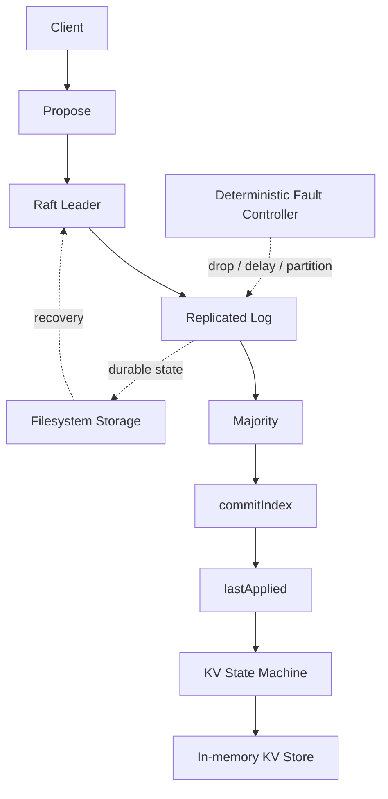

# raft-kv

> A fault-aware, Raft-based distributed key-value store in Go, built to make consensus, persistence, recovery, and failure behavior observable through implementation and deterministic tests.

**Status:** Experimental / portfolio project  
**Language:** Go  
**Architecture:** Raft consensus + replicated log + deterministic KV state machine

## What is this?

`raft-kv` is a small distributed key-value store built from first principles around the Raft consensus algorithm.

The system is intentionally narrow. It focuses on the parts of distributed systems that become difficult when machines fail:

- leader election
- replicated logs
- majority-based commitment
- state-machine application
- persistent Raft state
- restart recovery
- deterministic fault injection
- correctness-oriented testing

The project is designed around a simple principle:

> **The system should remain correct under failure, not merely work when everything is healthy.**

This is not intended to be a full database platform. There is no SQL layer, sharding system, transaction engine, or giant frontend hiding the interesting parts.

## Why it exists

A distributed system is easy to make look functional.

A few nodes can exchange messages, a leader can append entries, and a demo can happily print `PUT succeeded`.

The harder question is what happens when:

- the leader disappears halfway through a write;
- messages arrive late or out of order;
- a node is partitioned from the majority;
- durable state is only partially persisted;
- a committed entry has not yet been applied;
- a node restarts with both committed and uncommitted log entries.

`raft-kv` is built around those questions.

## Current capabilities

### Consensus

- Raft leader election
- term and vote management
- RequestVote
- AppendEntries
- leader heartbeats
- replicated log
- log conflict resolution
- `nextIndex` / `matchIndex`
- majority commitment
- current-term commitment rule

### State machine

- deterministic binary command encoding
- `PUT`
- `DELETE`
- in-memory key-value store
- ordered committed-entry application
- `commitIndex` / `lastApplied` separation
- deterministic Apply retry behavior

### Client write path

- leader-only proposals
- proposal waiters owned by the Raft event loop
- exact proposal-to-log-index/result correlation
- concurrent proposals
- context cancellation semantics
- proposal handling across leadership changes
- clean shutdown of pending proposals

### Durability and recovery

- filesystem-backed persistent Raft state
- atomic state-file replacement
- explicit durability boundary
- persisted `CurrentTerm`, `VotedFor`, `Log`, and `CommitIndex`
- corrupted-state rejection
- restart recovery
- committed-prefix state-machine replay
- uncommitted suffix preservation

### Failure testing

- deterministic message drop
- deterministic transport errors
- deterministic message delay/release
- network partition / heal
- process stop / restart testing
- storage failure injection
- state-machine Apply failure injection
- invariant-focused assertions
- structured failure traces

## Design at a glance



The core separation is deliberate:

```text
Raft
  owns consensus, ordering, commitment, and recovery metadata

KV
  owns command semantics and state-machine state

Storage
  owns durable Raft state

Fault infrastructure
  exists to make failure behavior reproducible
```

## Correctness model

The implementation treats several states as distinct:

```text
appended
   ↓
replicated
   ↓
committed
   ↓
applied
   ↓
proposal completed
```

A command being appended is not the same as being committed.

A command being committed is not the same as being applied.

A caller receiving success is not the same as either of those intermediate states.

That distinction is important for failure handling, especially around leadership loss and caller cancellation.

The project explicitly avoids claiming stronger guarantees than the implementation and tests establish. For example:

- local `GET` is not a linearizable read;
- exactly-once client semantics are not provided;
- full failover + restart state-machine safety is not treated as proven merely because selected tests pass.

See [`docs/correctness.md`](docs/correctness.md) for the current invariant classifications and evidence.

## Quick start

### Requirements

The project is developed and tested with:

- Go 1.27.x
- Git
- Docker / Docker Compose for the containerized cluster workflow

The core implementation intentionally keeps runtime dependencies in the Go standard library.

### Build and test

```bash
go build ./...
go vet ./...
go test -race ./...
golangci-lint run
```

### Run the test suite repeatedly

The project uses deterministic controls heavily, especially around consensus and failure behavior.

```bash
go test -race -count=20 ./raft
go test -race -count=20 ./kv
go test -race -count=20 ./integration
go test -race -count=20 ./storage
```

### Run the cluster

The repository includes a three-node cluster configuration under:

```text
configs/three-node.yaml
```

The project also contains cluster/demo scripts under:

```text
scripts/
```

Use the scripts and README examples from the repository as the source of truth for the current cluster invocation.

### Three-node failover demo

A deterministic, in-process three-node failover walkthrough lives in `TestThreeNodeFailoverDemo` (`integration/demo_test.go`). It starts three nodes, confirms a biased first leader, writes `initial=one` through that leader, stops it, waits for a replacement leader and writes `extra=two` through the replacement, restarts the stopped node on its retained durable state, and waits until all three nodes have applied both writes. Every step is real Raft code with poll-based waits and no sleeps.

```bash
make demo
```

or directly:

```bash
go test -v ./integration -run '^TestThreeNodeFailoverDemo$'
```

Run it repeatedly (`-count=20`) to watch the deterministic failover and catch-up behavior.

### Three-node PUT benchmark

`BenchmarkThreeNodePUT` (`integration/benchmark_test.go`) measures the real three-node `Node.Propose` path: encode a PUT, replicate, commit, apply, return. It uses in-memory transport and storage, so it measures the Raft code, not a production network or disk durability.

```bash
make benchmark
```

or directly:

```bash
go test -run '^$' -bench '^BenchmarkThreeNodePUT$' -benchmem -benchtime=100ms ./integration
```

Numbers are environment-specific; see [`docs/benchmarks.md`](docs/benchmarks.md) for methodology and caveats.

## Example workflow

The intended write path is:

```text
PUT foo=bar
    ↓
Raft leader accepts proposal
    ↓
command appended as current-term log entry
    ↓
entry replicated to a majority
    ↓
commitIndex advances
    ↓
entry is applied to the KV state machine
    ↓
proposal returns its exact result
```

A leader failure is intentionally not treated as a special magical case. The same Raft machinery handles the state transition:

```text
leader
  ↓
failure / partition
  ↓
remaining majority elects a leader
  ↓
new writes continue
  ↓
isolated node rejoins
  ↓
uncommitted suffix is repaired
```

## Persistence and recovery

The durable representation contains:

```text
CurrentTerm
VotedFor
Log
CommitIndex
```

`LastApplied`, leader state, replication indexes, timers, proposal waiters, and other runtime state are reconstructed rather than persisted.

On restart, the node:

1. loads and validates persistent state;
2. replays only the committed log prefix into a fresh in-memory KV state machine;
3. reconstructs `LastApplied`;
4. starts as a follower;
5. rejoins normal Raft operation.

An uncommitted durable suffix is retained in the log but is not applied during recovery.

Corrupt persistent state is rejected rather than silently treated as a fresh node.

## Failure testing

Failure handling is a first-class part of the project.

The deterministic test infrastructure can exercise scenarios such as:

| Failure | What is tested |
|---|---|
| Leader failure | election, continued majority progress |
| Follower failure | majority availability, later catch-up |
| Minority partition | inability of the minority to commit |
| Leader partition | new majority leader, old leader step-down |
| Dropped RPCs | retry and progress |
| Delayed RPCs | stale completion handling |
| Storage failure | persistence ordering and false-success prevention |
| Apply failure | ordered retry and blocked suffix |
| Restart | persistent-state recovery and state reconstruction |

The test suite also uses invariant assertions and structured traces so that a failed scenario can be diagnosed rather than merely reported as a generic assertion failure.

More detail is in [`docs/failure-scenarios.md`](docs/failure-scenarios.md).

## Architecture

The repository is organized around a few focused boundaries:

```text
raft-kv/
├── cmd/
│   ├── server/
│   └── client/
├── raft/
├── kv/
├── transport/
├── storage/
├── cluster/
├── fault/
├── tests/
├── integration/
├── docs/
├── configs/
└── scripts/
```

### `raft/`

Consensus and replicated-state-machine orchestration:

- node lifecycle
- election
- replication
- commitment
- application
- proposal lifecycle
- recovery integration

### `kv/`

The deterministic state machine:

- command representation
- encoding/decoding
- PUT / DELETE semantics
- local GET

### `storage/`

Persistent Raft state:

- filesystem storage
- versioned binary format
- atomic replacement
- durability boundary

### `fault/`

Deterministic failure control used by the test environment.

### `transport/`

Production delivery adapters. The package defines the deterministic wire format
(versioned framing, payload codecs, request IDs), the request/response
correlation primitive, and a real TCP client transport + server that speak it.
`TCPTransport` implements `raft.Transport` over per-peer sockets and `Server`
dispatches decoded requests to the `raft.Node` RPC handlers, so two nodes
replicate over TCP with the same semantics `fault.Network` provides. See
[`docs/transport.md`](docs/transport.md).

### `integration/`

End-to-end cluster scenarios.

### `docs/`

Design, protocol, correctness, failure-scenario, and benchmark documentation.

## Important tradeoffs

### Standard library first

The core uses Go's standard library wherever practical.

That keeps the consensus implementation inspectable and avoids hiding Raft behavior behind external abstractions.

### Event-loop ownership

Mutable Raft state is owned by a single event loop.

Transport and timer activity returns to that loop through explicit events rather than directly mutating protocol state from background goroutines.

This makes concurrency boundaries easier to reason about and makes race detection useful.

### Persistence before publication

Persistent Raft state is constructed as a candidate state, saved, and only then published as live state.

That ordering is used for term, vote, log, and commit metadata changes.

### Deterministic failures over random chaos

The failure framework favors reproducible scenarios over probabilistic "chaos" for the core test suite.

The goal is to answer:

> "Can we reproduce and explain this failure?"

before asking:

> "Can we generate thousands of random failures?"

## Current status

The project currently has completed milestones covering:

```text
✓ foundational contracts
✓ leader election
✓ replicated log and commitment
✓ KV state machine
✓ client proposal path
✓ durable Raft state
✓ restart recovery
✓ deterministic fault injection
✓ snapshots and log compaction
✓ three-node benchmark evidence
✓ three-node failover demo
✓ wire protocol and correlation (versioned framing, payload codecs, request IDs)
✓ TCP transport (real sockets, implements raft.Transport, replication between two nodes)
```

The next major engineering milestone is:

```text
→ broader production hardening: streaming witnesses, membership changes, linearizable reads
```

The final polish phase is intended to keep refining benchmark evidence, the failure demo, and portfolio-oriented documentation.

## Roadmap

### Delivered

- snapshots and log compaction (state-machine snapshots, compacted log boundaries, snapshot installation for lagging followers, recovery from snapshots)
- three-node benchmark evidence (in-memory proposal-path throughput, see [`docs/benchmarks.md`](docs/benchmarks.md))
- three-node failover demo (leader stop, replacement election, restart, catch-up, convergence, see [`scripts/demo-failover.sh`](scripts/demo-failover.sh))
- wire protocol, correlation, and real TCP transport (versioned framing, payload codecs, request IDs, a `raft.Transport` implementation over per-peer sockets, and an inbound RPC dispatcher, see [`docs/transport.md`](docs/transport.md))

### Next

Planned work includes:

- membership changes and configuration change safety
- linearizable (quorum) reads
- streaming backup witnesses / replica divergence detection
- broader adversarial and randomized failure testing
- production-network benchmark methodology (real transport, disk-backed storage)

## Contributing

The project is intentionally structured so contributors can reason about one layer at a time.

For local development:

```bash
gofmt -w .
go vet ./...
go test -race ./...
golangci-lint run
```

Before changing consensus behavior, read:

- [`docs/raft.md`](docs/raft.md)
- [`docs/correctness.md`](docs/correctness.md)
- [`docs/failure-scenarios.md`](docs/failure-scenarios.md)

The most valuable contributions are likely to be:

- correctness fixes with regression tests;
- adversarial failure scenarios;
- clearer invariants;
- reproducible benchmark methodology;
- improvements that preserve the existing architectural boundaries.

Please avoid expanding the project into unrelated database features unless the architecture and scope are deliberately revisited.

## Project philosophy

This project is less interested in:

```text
"How many features can fit in the repository?"
```

and more interested in:

```text
"What happens when the system is wrong, slow, partitioned, restarted, or half-failed?"
```

The implementation is intentionally accompanied by tests and documentation that explain not just what the code does, but what the system is actually guaranteed to do.

## License

See [`LICENSE`](LICENSE) for the project's license.

## Next step

Start with the three-node cluster and then run the failure-oriented test suite. The interesting part begins when a leader stops behaving like a leader.
